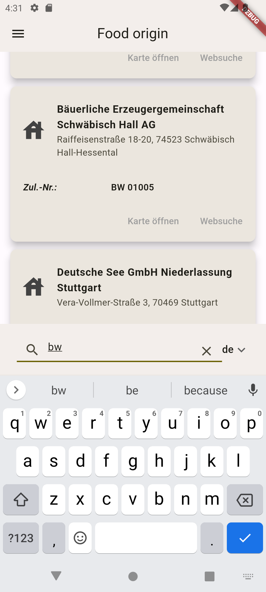

# Herkunft (German for *origin*)

Who is the manufacturer of the milk, cheese or sausage, for example? Was the cheaper product produced by the same manufacturer as a well-known brand product?

In order to identify the producer of products of animal origin, the EU has introduced the so-called EC identification and health marks (Genusstauglichkeits- und Identitätskennzeichen in Germany). It is an oval symbol that includes, among other things, the country of origin and the approval number of the manufacturing company.

This app that let's you quickly identify manufacturer by selecting the country and the approval number. Currently, the countries - Germany (DE), Austria (AT), Switzerland (CH), Italy (IT) and France (FR) are available in the app.

You can search for the address in your prefered map application and even start a web search for the company.

Since the data are extracted from the individual sides and I do not have an agreement with the authorities maintaining these data, the data is not included in this app. Some sample scripts to extract these data can be found at [this project](https://github.com/rokozeit/herkunft_daten).

**What is working at the moment:** Currently Windows and Android builds are working. I do not own an Mac so currently I cannot do the Apple part.

# How-to

## Set-up a flutter development environment
Best intro and further documentation can be found at the [flutter webpage](https://docs.flutter.dev/get-started/install)

## Download the sources
You can directly download them as zip-file or better clone the sources using [git](https://git-scm.com/). Check the button `Code` on upper right of this page.

## Build the app
On the command line go to the projects folder `herkunft` and then run the following command depending on your target operating system:

- Android build: `flutter build apk`
- Windows build: `flutter build windows`

## Get the data
As described above, I do not have an agreement with the authorities managing the data. So I cannot just provide them here.
The format for the [sqlite](https://www.sqlite.org/index.html) data base is:

 Each country has its own table. Keep country names short. Otherwise it might mess up the drop down list. I am using coutry codes.

 Each table has the same columns:
 - **name**: The name of the producer
 - **address**: The address - street-name number, postcode city - in my case
 - **approvalNo**: The actuall approval number of the EC identification and health marks
 - **approvalNoOld**: The old number (I think mainly in Germany)
 - **comment**: Some additional information

Some sample Python code on how to extract them is provided in [another project](https://github.com/rokozeit/herkunft_daten).

## Install the data
Once you have the sqlite data base built you can upload it to the Android device or you Windows computer. At the first start of the app you will be asked to import the data base with the default file browser. Once imported you can delete the original file. If you want to change the data base, you can do so via the menu at the top left. 