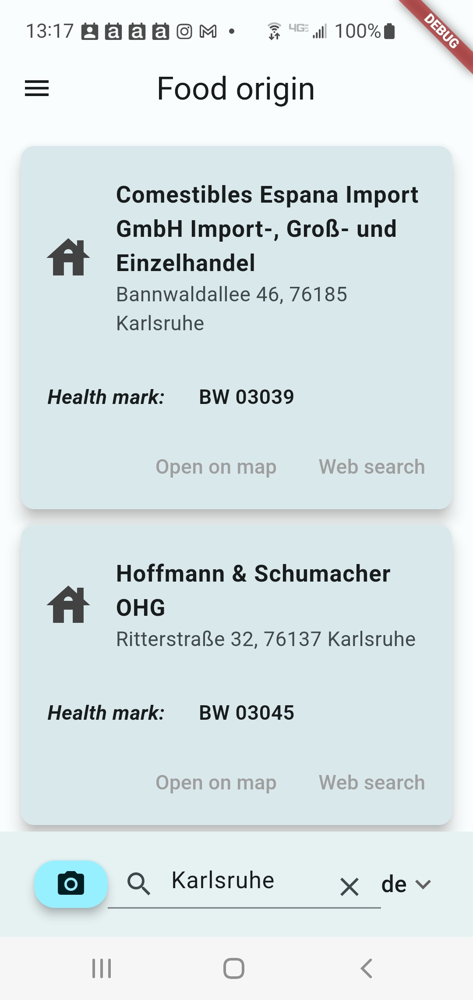

# Herkunft (German for *origin*)

Who is the manufacturer of the milk, cheese or sausage, for example? Was the cheaper product produced by the same manufacturer as a well-known brand product?

In order to identify the producer of products of animal origin, the EU has introduced the so-called EC identification and health marks (Genusstauglichkeits- und Identitätskennzeichen in Germany). It is an oval symbol that includes, among other things, the country of origin and the approval number of the manufacturing company.

*Screenshots of the Android App (left) and Windows Apps (rigth)*

This app that let's you quickly identify manufacturer by selecting the country and the approval number. Currently, the countries - Germany (DE), Austria (AT), Switzerland (CH), Italy (IT) and France (FR) are available in the app.

*Sample health marks - not actually existing*

You can search for the address in your prefered map application and even start a web search for the company.

Since the data are extracted from the individual sides and I do not have an agreement with the authorities maintaining these data, the data is not included in this app. Some sample scripts to extract these data can be found at [this project](https://github.com/rokozeit/herkunft_daten).

**What is working at the moment:** Currently Windows and Android builds are working. I do not own an Mac so currently I cannot do the Apple part.

# How-to

## Set-up a flutter development environment
Best intro and further documentation can be found at the [flutter webpage](https://docs.flutter.dev/get-started/install)

## Download the sources
You can directly download them as zip-file or better clone the sources using [git](https://git-scm.com/). Check the button `Code` on upper right of this page.

## Build the app
On the command line go to the projects folder `herkunft` and then run the following command depending on your target operating system:

- Android build: `flutter build apk`
- Windows build: `flutter build windows`

## Get the data
As described above, I do not have an agreement with the authorities managing the data. So I cannot just provide them here.
The format for the [sqlite](https://www.sqlite.org/index.html) data base is:

 Each country has its own table. Keep country names short. Otherwise it might mess up the drop down list. I am using coutry codes.

 Each table has the same columns:
 - **name**: The name of the producer
 - **address**: The address - street-name number, postcode city - in my case
 - **approvalNo**: The actuall approval number of the EC identification and health marks
 - **approvalNoOld**: The old number (I think mainly in Germany)
 - **comment**: Some additional information

Some sample Python code on how to extract them is provided in [another project](https://github.com/rokozeit/herkunft_daten).

## Install the data
Once you have the sqlite data base built you can upload it to the Android device or you Windows computer. At the first start of the app you will be asked to import the data base with the default file browser. Once imported you can delete the original file. If you want to change the data base, you can do so via the menu at the top left.

## Usage
### Country selection
Select the country you are searching the health mark for. Usually you find the country code on the health mark label.

### Typing the code
Type in the code. Do not type in the country code and no `EC`, `CE` here.

*Sample health marks*

*Screenhot of the search on Android*

### Scanning the code
`Currently only available on Android`.

Click on the camera button for scanning the code. A dialog is opened. You might need to `grant access` for the app to use the camera.

Point the camera towards the code so it appears in the the blue rectangle. Not the country code and no `EC`, `CE`). See images above. Wait till the code is recognised and then press `OK`.

*Screenhot of the scanning on Android*

### Searching by name or address
If you want to find a specific company or all companies in a city or specific address, you can enter the name or address as search string or scan the name or address via the camera button (`The later currently only available on Android`).

*Screenhot of search for city on Android*

### Search result
If the code is found in the data base you will see some cards with the information on the company found.

### Get additional information or direction
You can click the `Open on map` button to see the companies location on a map.

You can click the `Web search` button to search for the company online.

## Some typical issues
### No result
Did you choose the correct country code in the drop down?

Did you include the country code or `EC`, `CE`? If yes, leave it out.

May be the wrtiting of the code in the data base is different from yours.

May be the code is not in the data base.

### No results with camera
If the search field is empty after hitting `OK` button there might not have been a final reading. Please try again.

Check the result of the reading. There might be some issues with the text recognition.

# Updates
2023-11-18: For Android added scanning the health mark with the phone camera - used library [flutter_scalable_ocr](https://pub.dev/packages/flutter_scalable_ocr)
2023-11-01: Updated flutter (2.7.x => 3.1.x) and libraries from 2021 version to new 2023 up to date versions